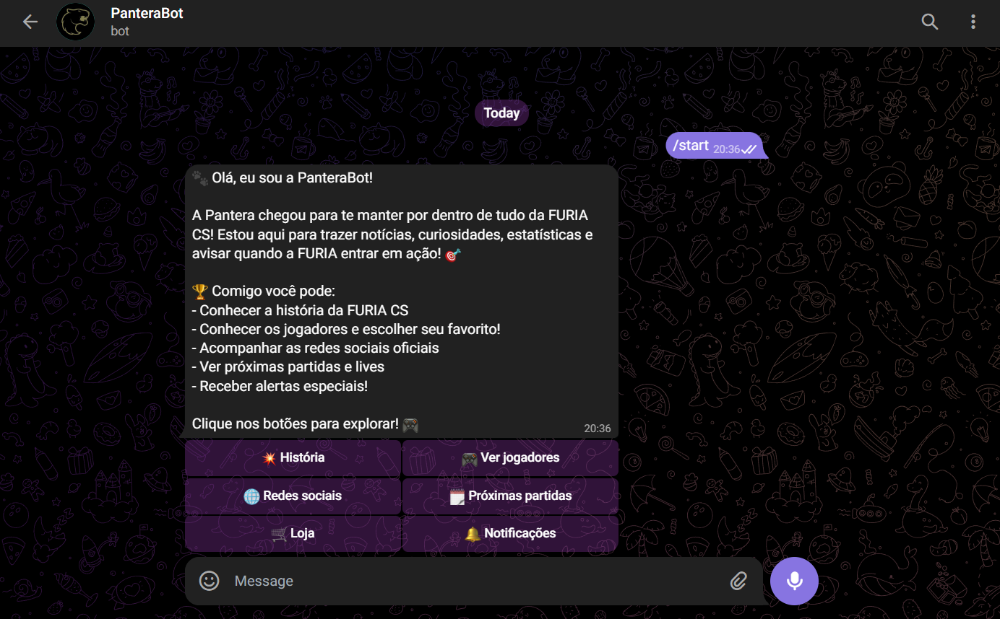
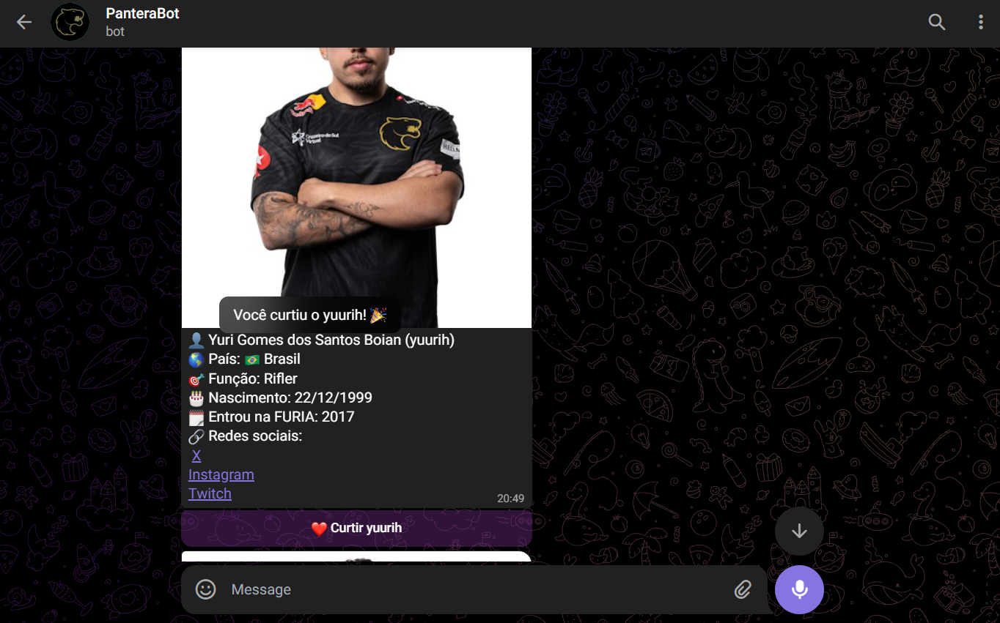
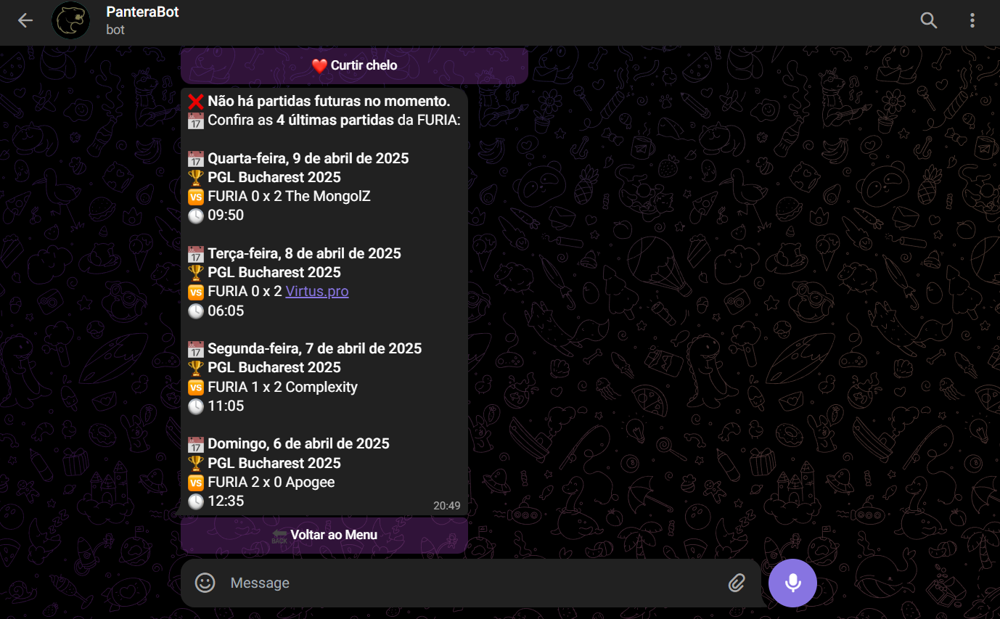
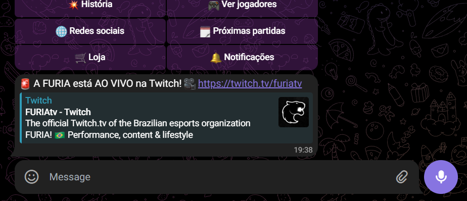

# 🐾 PanteraBot – Chatbot da FURIA !!

**PanteraBot** é um bot do Telegram feito com 💜 para os fãs da **FURIA CS**!  
Ele entrega informações atualizadas sobre o time de **Counter-Strike**, incluindo **próximos jogos**, **redes sociais**, **jogadores** e **notificações ao vivo da Twitch** da FURIA.


## 📸 Preview

 
 
 

---

## 🧠 Proposta

O objetivo do **PanteraBot** é conectar fãs da FURIA com informações importantes e atualizadas, de forma rápida e divertida, direto pelo Telegram.  
Ideal para quem quer acompanhar o time **sem perder nada**.

---

## 🚀 Funcionalidades

- 💥 **História**: Conheça a História da Furia! 
- 📅 **Próximas partidas**: Veja os próximos confrontos da FURIA no CS:GO.
- 🧑‍💻 **Ver jogadores**: Conheça os Jogadores do elenco.
- 📚 **Redes sociais**: Acompanhe as Redes Sociais da Furia.
- 🛒 **Loja**: Conheça a Loja Oficial da Furia.
- 🔔 **Notificações**: Receba alertas quando a FURIA estiver ao vivo na Twitch.
- ❤️ **Curtir**: Aproveite e escolha seu Jogador favorito da Furia CS!
- ⬅️ **Voltar**: Retorna ao menu principal.

---

## 🛠️ Tecnologias e Ferramentas

- Python
- python-telegram-bot
- APScheduler
- SQLite (armazenamento local)
- Twitch API
- Railway (hospedagem)

---

## ✅ Notificação Da Live na Twitch
 
## 🧪 Como rodar localmente

1. **Clone o repositório:**
```bash
git clone https://github.com/beatrizkloss/chatbot-Pantera.git
cd chatbot-Pantera
```

2. **Crie um ambiente virtual:**
```bash
python -m venv venv
source venv/bin/activate    # Para Linux/macOS
venv\Scripts\activate       # Para Windows
```

3. **Instale as dependências:**
```bash
pip install -r requirements.txt
```

4. **Crie um arquivo `.env` na raiz do projeto com o seguinte conteúdo:**
```
TELEGRAM_TOKEN=seu_token
TWITCH_CLIENT_ID=sua_client_id
TWITCH_CLIENT_SECRET=sua_secret
TWITCH_ACCESS_TOKEN=seu_token_de_acesso
```

5. **Execute o bot:**
```bash
python app/main.py
```

---

## 🤖 Como usar no Telegram

1. Acesse [t.me/cspantera_bot](https://t.me/cspantera_bot)  
2. Clique em **“Start”**  
3. Use os **botões interativos** para navegar pelas funcionalidades do bot  

---

## ✨ Melhorias Futuras

- Integrar API para partidas, com detalhes em tempo real e históricos
- Enviar alertas automáticos quando a FURIA estiver jogando ao vivo
- Criar um quiz interativo para testar os conhecimentos dos torcedores
- Implementar mini jogos temáticos para entreter enquanto aguardam as partidas
- Suporte a múltiplos idiomas 
